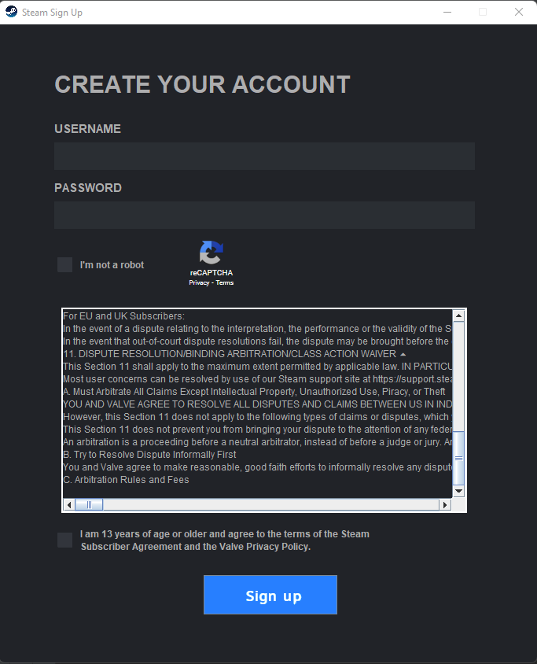
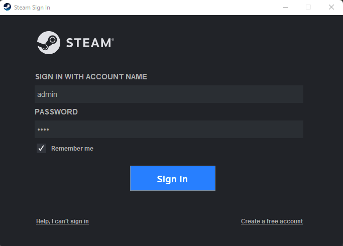

# Steam 2.0

## Introduction

Steam wannabe

## Features so far

So far the accounts are being saved with the Account class storing them into a local file using FileOutputStream. Soon I'll start using a database as I will have to make lists of games, wishlists, friends lists and so on.

- Sign up frame:

- Log in frame:

- Main frame:

[comment]: <> 

- Friends and Chat frame:

[comment]: <> 